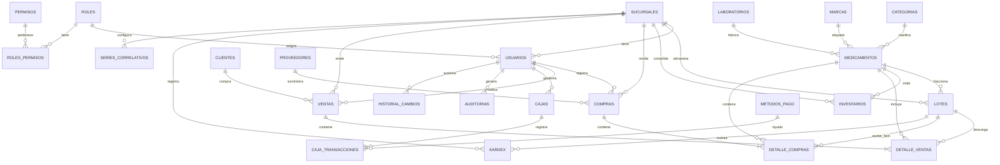

# Documentación de la Base de Datos PostgreSQL - ERP Botica/Farmacia

Esta base de datos ha sido diseñada y construida utilizando **PostgreSQL 16** como motor principal, normalizada bajo la **Tercera Forma Normal (3FN)** para garantizar la integridad, reducir la redundancia de datos y maximizar el rendimiento transaccional de un sistema de gestión farmacéutica.

---

## 1. Diagrama Entidad-Relación (ERD)

A continuación, se detalla la arquitectura de las tablas y sus relaciones representadas en formato **Mermaid.js**. Puede visualizarse directamente en cualquier visor de Markdown compatible o editor como GitHub/AI Studio:

---

## 2. Diccionario de Datos y Estructura de Tablas

### 2.1. Gestión de Accesos, Seguridad y Personal

#### Tabla: `sucursales`
Almacena las sucursales físicas que componen la red de farmacias.
*   `id` (VARCHAR(50), PK): Identificador único de sucursal (ej. 'SUC-CENTRAL').
*   `nombre` (VARCHAR(150), NOT NULL): Nombre comercial de la sucursal.
*   `direccion` (TEXT): Ubicación física.
*   `ubigeo` (VARCHAR(6)): Código ubigeo de la locación (SUNAT).
*   `ciudad` (VARCHAR(100)): Ciudad o provincia.
*   `telefono` (VARCHAR(20)): Número de contacto.

#### Tabla: `roles`
Define las jerarquías de acceso del ERP.
*   `id` (SERIAL, PK): Identificador secuencial.
*   `nombre` (VARCHAR(50), UNIQUE, NOT NULL): Nombre del rol ('Administrador', 'FarmaceuticoRegente', 'Almacenero', 'Cajero').
*   `descripcion` (TEXT): Detalle de funciones autorizadas.

#### Tabla: `permisos`
Catálogo de capacidades o endpoints de la API restringidos.
*   `id` (SERIAL, PK): Identificador secuencial.
*   `nombre` (VARCHAR(100), UNIQUE, NOT NULL): Código del permiso (ej. 'usuarios:gestionar').
*   `descripcion` (TEXT): Explicación del alcance del permiso.

#### Tabla: `roles_permisos`
Tabla de asociación de muchos a muchos (M:N) para roles y sus permisos.
*   `rol_id` (INT, FK): Referencia a la tabla `roles` (ON DELETE CASCADE).
*   `permiso_id` (INT, FK): Referencia a la tabla `permisos` (ON DELETE CASCADE).

#### Tabla: `usuarios`
Personal del sistema. Admite autenticación estándar con Bcrypt y enlace mediante SSO de Firebase Auth.
*   `id` (SERIAL, PK): Identificador secuencial.
*   `uid` (VARCHAR(128), UNIQUE): UID proporcionado por Firebase Authentication.
*   `username` (VARCHAR(50), UNIQUE, NOT NULL): Nombre de inicio de sesión.
*   `nombre` (VARCHAR(150), NOT NULL): Nombres y apellidos completos.
*   `email` (VARCHAR(150)): Correo institucional.
*   `rol_id` (INT, FK): Referencia a `roles`.
*   `id_sucursal` (VARCHAR(50), FK): Referencia a `sucursales`.
*   `activo` (BOOLEAN, DEFAULT TRUE): Estado de habilitación.
*   `requiere_cambio_password` (BOOLEAN, DEFAULT FALSE): Flag de seguridad obligatoria.
*   `password` (VARCHAR(255)): Contraseña encriptada unidireccionalmente mediante **Bcrypt** (Nunca texto plano).

---

### 2.2. Entidades Comerciales

#### Tabla: `clientes`
Registro de compradores. Soporta emisión de facturas (RUC) y boletas (DNI).
*   `id` (VARCHAR(50), PK): ID del cliente.
*   `tipo_documento` (VARCHAR(10), CHECK): 'DNI' o 'RUC'.
*   `numero_documento` (VARCHAR(20), UNIQUE, NOT NULL): Identificación tributaria.
*   `nombre_razon_social` (VARCHAR(200), NOT NULL): Nombre completo o razón social.
*   `es_socio` (BOOLEAN, DEFAULT FALSE): Identifica si pertenece al programa de beneficios (tarifas preferenciales).

#### Tabla: `proveedores`
Laboratorios y droguerías distribuidoras de insumos farmacéuticos.
*   `id` (VARCHAR(50), PK): ID de proveedor.
*   `ruc` (VARCHAR(20), UNIQUE, NOT NULL): RUC del proveedor.
*   `razon_social` (VARCHAR(200), NOT NULL): Razón social.

---

### 2.3. Catálogo de Productos e Inventarios

#### Tablas Maestras de Medicamentos: `categorias`, `marcas`, `laboratorios`
*   Normalizan campos del medicamento para evitar redundancias (ej. nombre de laboratorios duplicados).

#### Tabla: `medicamentos`
Información clínica y comercial del fármaco.
*   `id` (VARCHAR(50), PK): ID de medicamento.
*   `codigo_barras` (VARCHAR(100), UNIQUE): Código EAN/GTIN para escáner POS.
*   `nombre` (VARCHAR(200), NOT NULL): Nombre comercial.
*   `principio_activo` (VARCHAR(200)): Denominación Común Internacional (DCI).
*   `concentracion` (VARCHAR(100)): Detalle de dosis (ej. '500 mg').
*   `presentacion` (VARCHAR(150)): Empaque (ej. 'Caja x 100 tabletas').
*   `laboratorio_id`, `categoria_id`, `marca_id` (INT, FK): Enlaces normalizados.
*   `registro_sanitario` (VARCHAR(50)): Registro sanitario DIGEMID obligatorio.
*   `requiere_receta` (BOOLEAN, DEFAULT FALSE): Restricción de venta legal.
*   `precio_sugerido` (DECIMAL(10,2)): Precio base sugerido de venta.

#### Tabla: `lotes`
El inventario real está subdividido en lotes físicos para controlar la trazabilidad de fechas de caducidad.
*   `id` (VARCHAR(50), PK): ID interno de lote.
*   `id_producto` (VARCHAR(50), FK): Referencia a `medicamentos`.
*   `id_sucursal` (VARCHAR(50), FK): Sucursal física donde reposa el lote.
*   `numero_lote` (VARCHAR(50), NOT NULL): Código impreso por el fabricante (ej. 'L-2024-01').
*   `fecha_vencimiento` (VARCHAR(10), NOT NULL): Fecha de expiración (YYYY-MM-DD).
*   `stock` (INT, CHECK >= 0): Stock disponible actual en este lote. Se autoprotege contra stock negativo.
*   `precio_compra` (DECIMAL(10,2)): Costo unitario de adquisición.
*   `precio_venta` (DECIMAL(10,2)): Precio de salida en POS.

#### Tabla: `inventarios`
Acumulado general del stock total por medicamento en cada sucursal para optimizar consultas del buscador.
*   `id_producto` + `id_sucursal` (Compound Unique Constraint).
*   `stock_total` (INT): Suma consolidada automática de los lotes de esa sucursal.

---

### 2.4. Transaccionalidad de Caja y Movimientos de Almacén

#### Tabla: `movimientos_inventario`
Bitácora detallada de flujos físicos de stock (Ingresos, Salidas, Ajustes, Traslados).

#### Tabla: `compras` / `detalle_compras`
Ingreso de stock provisto por droguerías autorizadas.

#### Tabla: `ventas` / `detalle_ventas`
Emisión de comprobantes de pago e ingresos en botica.
*   Soporta Boleta, Factura, y Nota de Crédito/Débito (mediante `id_venta_referencia` y `motivo_anulacion`).
*   Registra el `hash_sunat` y `estado_sunat` simulados para auditoría tributaria en tiempo real.

#### Tabla: `cajas`
Manejo de flujo de efectivo en mostrador por turnos/sesiones.
*   Controla montos de apertura, ingresos según método de pago, egresos/retiros parciales y montos de cierre.

#### Tabla: `metodos_pago` y `caja_transacciones`
*   `metodos_pago` incluye: 'Efectivo', 'Tarjeta de Crédito', 'Tarjeta de Débito', 'Yape/Plin' y 'Transferencia Bancaria'.
*   `caja_transacciones` realiza el desglose de cada pago que afecta directamente a la caja abierta.

---

### 2.5. Libros de Control, Parámetros y Auditoría

#### Tabla: `kardex`
Libro diario de movimientos de inventario valorizado. Registra cronológicamente entradas, salidas, saldos físicos y valores monetarios de cada producto por lote y sucursal.

#### Tabla: `configuracion_general`
Configuraciones clave del sistema como tasa del impuesto (IGV_PORCENTAJE = 18), RUC oficial del negocio y parámetros de alarmas de abastecimiento.

#### Tabla: `auditorias`
Bitácora de seguridad interna de acciones de alto impacto realizadas por usuarios (ej. 'ALTERACION_PRECIO', 'ELIMINAR_USUARIO'). Registra usuario, módulo, acción, detalle, IP del dispositivo y fecha exacta.

#### Tabla: `historial_cambios`
Trazabilidad de datos DML a nivel de fila. Guarda una captura JSONB del estado anterior (`valor_anterior`) y posterior (`valor_nuevo`) de cualquier inserción, modificación o borrado de datos.

---

## 3. Optimización por Índices de Rendimiento

Se crearon índices específicos basados en campos de alta concurrencia de consulta:
1.  `idx_medicamentos_codigo`: Permite búsquedas instantáneas por código de barras de medicamentos en el mostrador del POS.
2.  `idx_clientes_documento` e `idx_proveedores_ruc`: Aceleran la carga de datos tributarios por DNI o RUC.
3.  `idx_lotes_vencimiento` y `idx_lotes_numero`: Facilitan las alertas automatizadas del farmacéutico regente sobre medicamentos vencidos o por caducar.
4.  `idx_ventas_fecha` y `idx_compras_fecha`: Agilizan la emisión de reportes contables mensuales y reportes diarios consolidados.
5.  `idx_kardex_producto_sucursal` e `idx_kardex_fecha`: Optimizan el filtrado secuencial de tarjetas de kardex valorizado.

---

## 4. Triggers y Reglas de Negocio en la Base de Datos

Para asegurar una consistencia absoluta que evite inconsistencias en el frontend y operaciones corruptas, se implementaron reglas a nivel de motor de base de datos utilizando PostgreSQL PL/pgSQL:

### A. Procesamiento Automatizado de Detalle de Ventas (`tg_procesar_detalle_venta`)
Al registrarse cada item vendido en la tabla `detalle_ventas`, la base de datos ejecuta automáticamente:
1.  **Deducción Física de Stock**: Resta la cantidad comprada directamente del lote asignado (`lotes.stock`).
2.  **Protección de Stock Negativo**: Verifica que la cantidad disponible cubra la venta. Si el stock resultante fuera inferior a cero, aborta la transacción completa y emite una excepción estructurada para el POS.
3.  **Actualización Consolidada**: Resta la cantidad vendida del inventario general consolidado por sucursal (`inventarios.stock_total`).
4.  **Bitácora de Movimiento**: Genera un registro automático en `movimientos_inventario` asociando al usuario cajero y el comprobante de venta.
5.  **Historial en Kardex**: Calcula el saldo actual y genera el asiento valorizado correspondiente en la tabla `kardex`.

### B. Procesamiento Automatizado de Compras (`tg_procesar_detalle_compra`)
Al registrarse la recepción de mercadería de proveedores en la tabla `detalle_compras`:
1.  **Ingreso de Stock**: Incrementa la cantidad recibida en el lote correspondiente (`lotes.stock`).
2.  **Suma Consolidada**: Incrementa el inventario general por sucursal (`inventarios.stock_total`).
3.  **Registro de Movimiento**: Escribe la entrada en `movimientos_inventario`.
4.  **Asiento de Kardex**: Registra el ingreso en el libro diario de inventario valorizado (`kardex`).

### C. Alerta y Auditoría de Seguridad por Precios (`tg_auditar_cambio_precio_lote`)
Cada vez que un administrador u operario modifica el precio de venta de un lote de medicamentos (`lotes.precio_venta`), un trigger detecta el cambio e inserta de forma automática un evento de auditoría en la tabla `auditorias` detallando el precio anterior, el nuevo precio, el lote modificado y la marca temporal para prevenir fraudes.

---

## 5. Datos Iniciales Integrados (Seed)
El script de inicialización incluye configuraciones corporativas peruanas preestablecidas:
*   **Roles y Permisos**: Roles preconfigurados ('Administrador', 'FarmaceuticoRegente', 'Almacenero', 'Cajero') con permisos jerárquicos de gestión, POS, almacén y lectura.
*   **Sucursal Central**: Registro de la sucursal matriz en Cercado de Lima.
*   **Métodos de Pago**: Métodos estándar de venta: Efectivo, Tarjetas Visa/Mastercard, Yape/Plin y Transferencia Bancaria.
*   **Series SUNAT**: Inicialización de correlativos obligatorios SUNAT para boletas (`B001`), facturas (`F001`) y notas de crédito/débito en la sucursal central.
*   **Configuraciones Generales**: Impuesto general a las ventas (`IGV_PORCENTAJE` = 18%) y umbral de alertas de desabastecimiento (`ALERTA_STOCK_MINIMO` = 15).
